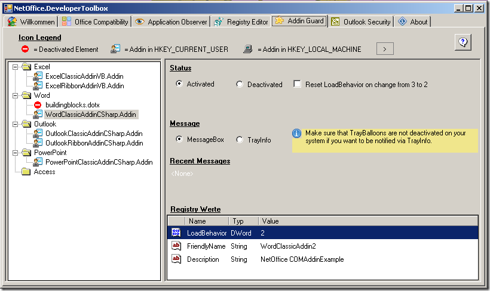

# Addin Guard

## What can the Addin Guard do for you?

When you develop a ComAddin for Office you maybe face the problem that you are
not sure whether your Addin have been loaded correctly. If an error occurs,
Office applications change the LoadBehavior or put them in the area "deactivated
elements". This, however, is often not made obvious to you as a developer. Addin
Guard can notify you when the LoadBehavior of an Addin changes or when it gets
marked as deactivated Element.

## Functionality and Settings

You can find all COMAddins and deactivated elements sorted by Office application
in the left area. Click on an element to get detailed information.You can
activate the Addin Guard in the upper right area.

### Setting: Reset LoadBehavior on change from 3 to 2.

If the LoadBehavior of your Addin changes from 3 (Load at Startup) to 2 (Load on
Demand), it is mostly cause by the Office application because an error occured.
Addin Guard can reset this value automatically for you. In this case you are
notified by MessageBox or TrayBalloon that the value has been restored.

You can choose wether you want to be notified by MessageBox or TrayBalloon in
the middle of the right area.Below is an area which logs the recent messages for
you. At the bottom you can see detailed information, i. e. registry-values for a
COMAddin or file-information for a deactivated element.
