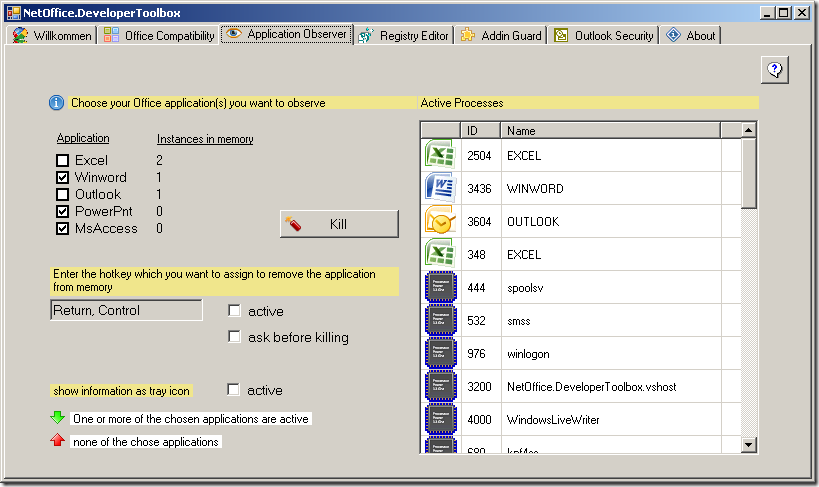

# Application Observer

## What does the Application Observer do for you?

If you are automating Office applications, it can easily happen that the
COM-Proxies assigned to you are not freed correctly upon error, e. g. if you
abort the debugging process too early.  You Office Application is then not
properly shut down and stays in memory. During longer development-sessions you
can accumulate a bit number of zombie-instances, which may (depending on the
Office application) causes problems.  The Application Observer helps you in
keeping an eye on one or more Office applications and -if you choose to- kill
them via a hotkey.

## Functionality and Settings

Choose the Office application you want to monitor (and possibly quit) in the
upper left area.  You can set global hotkey to quit the chosen Office
applications in the lower area.  The hotkey is limited to two keys. Futhermore,
you can activate a tray icon which shows you if the selected Office applications
are currently in memory.  In the right area you can find a list of all currently
active processes for your information.
