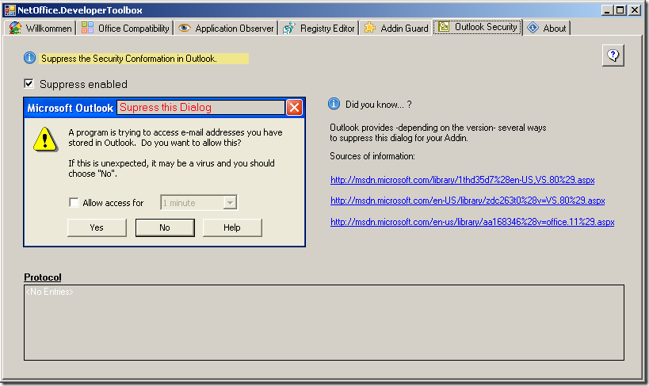

# Outlook Security

## What can the Outlook Security do for you?

When you automate Microsoft Outlook via COM then you or your users are maybe
presented with a dialog which is asking to authorize this access. If this dialog
is shown depends on which part of Outlooks object-model you want to access.
Among others, specific contact data and sending/receiving mails are protected.
Depending on the type and frequency of the access this can get rather annoying
and also prevents unattended automation (Microsoft discourages unattended
automation of Office application, but it is done in reality anyway). The Outlook
Security Component suppresses this dialog for you and makes -reduced stress
level apart- automated testing of your addin possible.  Along with the
introduction of this security feature in 2002, a tool named "ClickYes" gained
popularity among Outlook developers. This tool runs in the background and
automatically confirms the security dialog.  The Outlook Security Component
works in principle just like "ClickYes" and confirms the dialog automatically.
One advantage of Outlook Security in comparison to "ClickYes" is that Outlook
Security does not need to be installed on the target system. The functionality
is located in the assembly NetOffice.OutlookSecurity.dll. How your Component can
utilize this assembly to provide its own ClickYes-functionality is described
below. Remark: Outlook offers -depending on the version- some options to not
show dialog for you assembly. Check these options before you decide to use
Outlook Security.



## Functionality and Settings

You can active Outlook Security with the checkbox 'Supress enabled'. At the
bottom you can find a protocol with the recent actions.

## Using NetOffice.OutlookSecurity.dll in your own assemblies.

Integrate the assembly with 'Links' in your project or copy the source-code into
your project. You can find the assembly in the application-folder of the
NetOffice Developer Toolbox. The soure-code is located in the folder "Source".
The activation is really easy:

### Example-activation in C#

```csharp
public void Foo()
{
    NetOffice.OutlookSecurity.Supress.Enabled = true;
}
```

Please make sure that you deactivate this functionality again when your program
ends.
