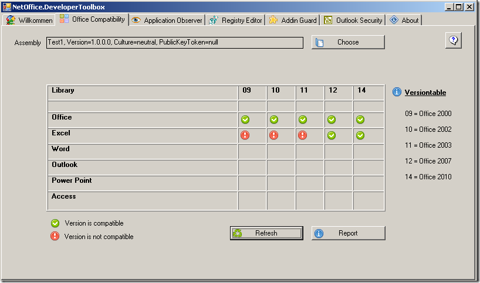

# Office Compatiblity

## What does Office Compatibility do for you?

If you develop a Office Solution with NetOffice (or any other API) which should
be compatible to a certain or multiple MS-Office version, you have to make sure,
that the functionality you use (objects, methods) is supported by this versions
of MS-Office.  For that reason, NetOffice provides this information as
IntelliSense Text for all Office objects.  Although this is a good help for
developers, it is not sufficient for big projects to ensure that your Office
Solution works with the MS-Office version you chose.  The manual effort of
testing and the associated error-rate are too high. The Office Compatibility
Component checks which MS-Office functionality the assembly you created is
calling and shows you with which MS-Office versions your solution is compatible.
You can make a valid and tested assertion about the compatibilty and comunicate
that to your clients and end-users.

## Screenshot

Example for an Assembly which uses functionality only present in Excel 2007 and
2010.

## Functionality and Settings

You can choose the assembly (which uses NetOffice to access MS-Office
programatically) in the upper area. The table gives you an overview which
Office-version your assembly can support. Click on the button "Report" if you
need a more detailed overview, which parts of your code work or won't work with
which version.

## Remarks

If you use the Office Compatibility Feature of the Developer Toolbox, you will
maybe see that your assemble works with no version of the targeted Office
application. This is not a bug in the program, the reason is that you address
different functionality which are only supported by different versions. In other
words: If you use a functionality which is only supported in Office 2000 and
Office 2002 and also use another functionality which is only provided by Office
2003, 2007 and 2010, then this means that your program-code will bring up an
error in any case, regardless which Office version is installed on the system.
Therefore, Office Compatibility shows you that this assembly is not compatible
with any version of MS-Office.
